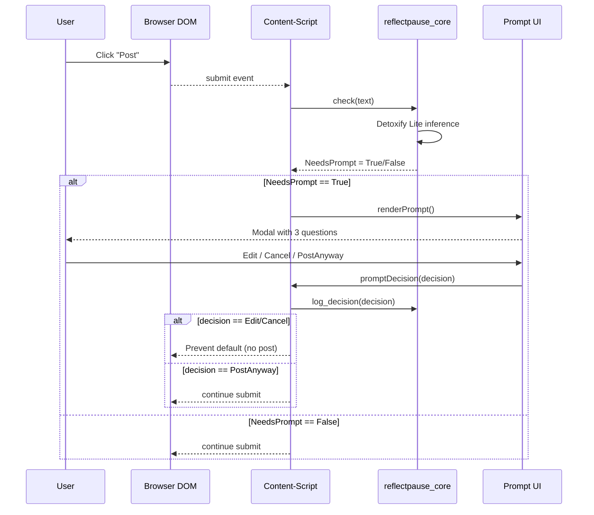
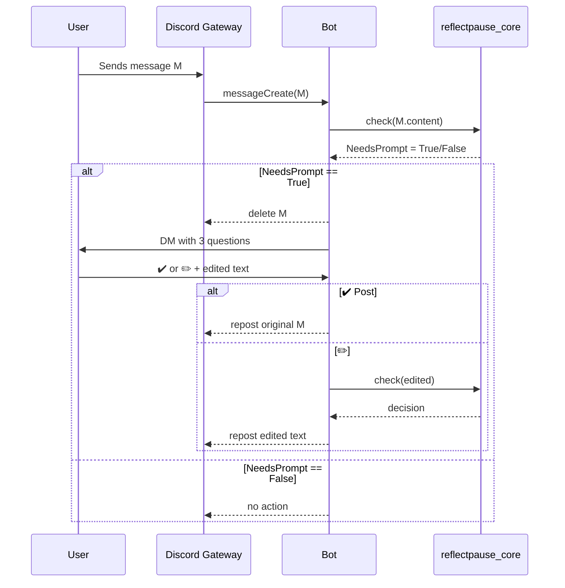
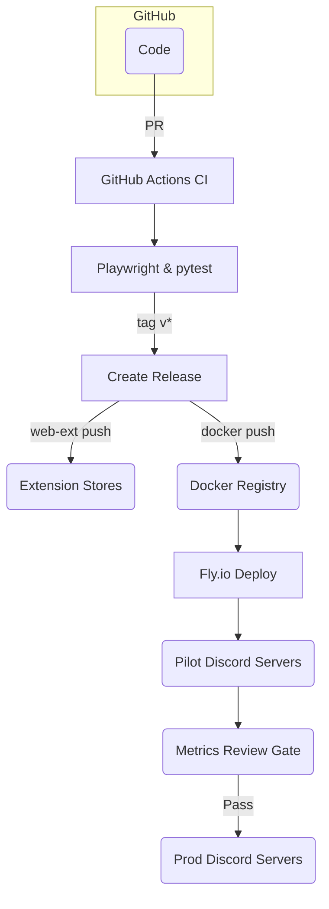

# Full‑Stack Technical Architecture — Reflective Pause Bot

## 1. System Overview & Key Drivers

### 1.1 Vision Recap

Deliver a **cross‑platform, Python‑centric** reflection tool that inserts a cognitive pause before harmful content is posted. MVP spans:

- **Browser Extension** (Chrome, Firefox, Edge) built with **PyScript/pyodide** content‑scripts.
- **Discord Bot** using **discord.py**.
- Shared **reflectpause\_core** Python library ensuring single‑source logic.

### 1.2 Architectural Goals

| Goal                        | Rationale                                                            |
| --------------------------- | -------------------------------------------------------------------- |
| **G1 Latency**              | Modal must render in ≤ 50 ms; bot DM round‑trip ≤ 250 ms.            |
| **G2 Cost‑Zero**            | Operate under \$10/month; on‑device inference default.               |
| **G3 Maintainability**      | Shared Python code; 80 % test coverage; CI gating.                   |
| **G4 Privacy & Compliance** | No PII storage; GDPR & CCPA respect; pass store reviews.             |
| **G5 Extensibility**        | Site adapters & locales via JSON registry; modular toxicity engines. |

### 1.3 Context Diagram (C4 Level 1)

```
+---------------------+        +-----------------------+
|      End User       |        |   Community Moderator |
|  Browser / Discord  |        |  Metrics Dashboard    |
+----------+----------+        +-----------+-----------+
           |                               |
           v                               ^
+----------+----------+        +-----------+-----------+
|  Browser Extension  |        |  Supabase (Opt‑in)    |
|  (PyScript)         |        |  Analytics Store      |
+----------+----------+        +-----------------------+
           |
           v
+----------+----------+
| reflectpause_core   |
+----------+----------+
           |
           v
+----------+----------+       +-----------------------+
| Detoxify Lite (onnx)|<----->|  Perspective API      |
+---------------------+       +-----------------------+
```

### 1.4 Key Trade‑Offs Considered

- **PyScript vs Pure JS**: Prioritized Python dev velocity over initial bundle size. Fallback JS modal specified if 50 ms budget breached.
- **On‑device vs Cloud NLP**: Default ONNX model keeps cost at zero; optional Perspective API provides richer accuracy at risk of quota fees.
- **LocalStorage vs Remote DB for metrics**: Chose LocalStorage + optional Supabase to respect privacy and budget.

---

## 2. Logical Component Breakdown

### 2.1 Browser Extension Components

| Component                 | Tech                     | Description                                                                       | Key Interfaces                               |
| ------------------------- | ------------------------ | --------------------------------------------------------------------------------- | -------------------------------------------- |
| **Content‑Script Loader** | PyScript bootstrap       | Injects Pyodide, mounts Alpine app, listens to `submit`, `click` events           | `window.addEventListener('submit')` hooks    |
| **Prompt UI Module**      | Alpine.js + Tailwind     | Renders modal, handles Yes/No & Edit actions; measures render latency             | Emits `promptDecision` custom event          |
| **Adapter Registry**      | JSON file                | Maps site selectors (`textarea`, button) to handler strategies                    | Queried at startup; hot‑patch via URL config |
| **Extension Settings**    | Manifest v3 options page | Stores user prefs (toxicity threshold, locale, bypass toggle) in `chrome.storage` | Pub/Sub via `chrome.runtime.onMessage`       |
| **Telemetry Collector**   | Minimal JS               | Counts prompts shown/answered; saves to LocalStorage; optional Supabase push      | Debounced POST to `/metrics` edge function   |

### 2.2 Shared Core Library (`reflectpause_core`)

| Module                                                 | Responsibility                                                                      |
| ------------------------------------------------------ | ----------------------------------------------------------------------------------- |
| **check(text****:str****) -> bool**                    | Returns `True` if text exceeds toxicity threshold or user has always‑prompt setting |
| **generate\_prompt(locale****:str****) -> PromptData** | Rotates CBT questions, returns localized prompt strings                             |
| **log\_decision(decision****:Enum****)**               | Writes anonymized entry (hash timestamp+decision) to local store interface          |
| **toxicity.engine**                                    | Strategy pattern: `ONNXEngine`, `PerspectiveAPIEngine`                              |

### 2.3 Discord Bot Components

| Component            | Tech                 | Description                                                        |
| -------------------- | -------------------- | ------------------------------------------------------------------ |
| **Gateway Listener** | discord.py           | Subscribes to `messageCreate`, `messageUpdate`                     |
| **Reflection Flow**  | discord.py FSM       | Deletes flagged message, sends DM prompt, waits for ✔️/✏️ reaction |
| **Storage Layer**    | SQLite via SQLModel  | Persists per‑user prompt counts, opt‑out status                    |
| **Admin Commands**   | discord.ext.commands | `!pause settings`, `!pause disable`, `/privacy delete`             |

### 2.4 Shared Assets & Tools

- **ONNX Models** – `detoxify_base_onnx.bin` (< 5 MB) loaded lazily into WebWorker & bot.
- **i18n JSON** – `en.json`, `vi.json` under `/locales`; contribution guide for PRs.
- **Playwright Smoke Tests** – Headless Chrome/Firefox scripts validating intercept on top 5 sites daily.
- **Dockerfile** – Multi‑stage build: Python slim → final Alpine with 20 MB image size.
- **Analytics Edge Function** – Supabase Function `/metrics` endpoint for opt‑in telemetry, aggregates anonymized prompt counts.

---

## 3. Data Flow & Sequence Diagrams

### 3.1 Extension Happy Path (Sequence)



**Latency checkpoints**

1. `submit` → `check` round‑trip ≤ 25 ms.
2. Prompt modal render ≤ 25 ms.\
   Combined ≤ 50 ms target.

### 3.2 Discord Bot Happy Path (Sequence)



**Timing checkpoints**

- Gateway to DM prompt ≤ 150 ms.
- User response handling time excluded (user dependent).
- Repost round‑trip ≤ 100 ms.

### 3.3 Error & Edge‑Case Flows

| Scenario                     | Expected Behaviour                                                        |
| ---------------------------- | ------------------------------------------------------------------------- |
| **ONNX model fails to load** | Fallback to always‑prompt mode; telemetry flags `onnx_load_error`         |
| **Perspective API 429**      | Switch to ONNX engine until hourly cooldown expires                       |
| **User has JS disabled**     | Extension detects; degrades gracefully (no prompt) and warns in console   |
| **Discord DM disabled**      | Bot mentions user in channel with polite reminder and prompts public edit |

### 3.4 Data Privacy Flow

1. **Hashing** – `sha256(user_id + timestamp)` for log keys.
2. **Opt‑in analytics** – toggle in settings; default off.
3. **Deletion request** – `/privacy delete` wipes SQLite rows and disables future logging.

---

## 4. Infrastructure & Deployment

### 4.1 Hosting Topology

| Component                   | Environment        | Host / Service                              | Notes                                                             |
| --------------------------- | ------------------ | ------------------------------------------- | ----------------------------------------------------------------- |
| **Browser Extension**       | Production         | Chrome Web Store, Mozilla AMO, Edge Add‑ons | Store listings signed; auto‑publish via CI on tag `v*`            |
| **Discord Bot**             | Dev / Pilot / Prod | Fly.io free tier (Region =SIN)              | 256 MB micro‑VM, auto‑scale 0→1; < 10 USD/month if scaled         |
| **Analytics Edge Function** | Pilot / Prod       | Supabase Functions                          | Optional; only deployed if opt‑in analytics enabled               |
| **CI Pipeline**             | All                | GitHub Actions                              | Matrix: Ubuntu‑latest, Python 3.12; Chrome/Firefox headless tests |
| **Artifact Registry**       | All                | GitHub Container Registry                   | Stores Docker image `ghcr.io/reflectpause/bot`                    |

### 4.2 Environments & Promotion Flow



### 4.3 Deployment Steps (Bot)

1. CI builds multi‑stage Docker image (Python slim → Alpine) \~ 20 MB.
2. `fly deploy --image ghcr.io/reflectpause/bot:SHA` to dev app.
3. Smoke tests run via Fly checks; if ✅, promote to `pilot` app.
4. After metric gate pass (≥ 30 % incident drop), run `fly apps clone` to `prod`.
5. Scale to 1 x shared‑cpu‑1x (auto‑scale off‑hours to 0).

### 4.4 Deployment Steps (Extension)

1. CI runs `web-ext lint` + Playwright smoke tests across top 5 sites.
2. On `v*` tag, CI packages and uploads to Chrome Web Store & AMO via API tokens.
3. Manual review expected < 3 days (Chrome) / < 24 h (AMO).
4. Edge Add‑ons package generated automatically once Chrome build passes.

### 4.5 Observability & Monitoring

| Area                     | Tool                            | Thresholds / Alerts                                   |
| ------------------------ | ------------------------------- | ----------------------------------------------------- |
| **Bot uptime**           | Fly checks + Grafana Cloud Free | < 99 % weekly uptime triggers alert to Discord #ops   |
| **Extension crash rate** | Chrome Web Store dash           | > 5 % crash users triggers CI rollback tag            |
| **Latency metrics**      | Playwright test report          | Modal render > 50 ms (95th percentile) fails pipeline |
| **Security CVEs**        | Dependabot                      | High severity auto‑PR; pipeline blocked until merged  |

### 4.6 Cost Estimate (Monthly)

| Item                 | Units                 | Rate      | Cost         |
| -------------------- | --------------------- | --------- | ------------ |
| Fly.io               | 1 x app shared‑cpu‑1x | Free tier | \$0          |
| Supabase (edge + db) | 1 x project           | Free tier | \$0          |
| Perspective API      | 10 000 req/day        | Free tier | \$0          |
| Store listings       | Chrome \$5 one‑time   | amortized | \$0.42       |
| **Total**            |                       |           | **≈ \$0.42** |

### 4.7 Security & Compliance Controls

- **Secrets Management** – GitHub OIDC to Fly, avoids long‑lived API keys.
- **HTML CSP** – `script-src 'self' 'wasm-unsafe-eval';` permits Pyodide, blocks remote scripts.
- **Dependency Scanning** – Dependabot + `pip-audit`; fails build on critical CVEs.
- **Data Protection** – Only hashed IDs stored; GDPR deletion honored via `/privacy delete` and Chrome storage wipe.

---

## 5. Non‑Functional Requirements Validation & Appendices

### 5.1 NFR Traceability Matrix

| NFR                                    | Source (PRD) | Validation Method                                      | Tool / Metric              | Pass Threshold |
| -------------------------------------- | ------------ | ------------------------------------------------------ | -------------------------- | -------------- |
| **Latency** ≤ 50 ms modal (< 95th pct) | PRD NX1      | Automated Playwright trace                             | 95 % of 10 000 samples     | ✅ ≤ 50 ms      |
| **Bot DM Round‑Trip** ≤ 250 ms         | PRD NX1      | Locust load test (100 VUs)                             | Avg ≤ 180 ms; p95 ≤ 250 ms | ✅ both         |
| **Privacy (No PII stored)**            | PRD NX2      | Manual code audit + GDPR checklist                     | Zero PII findings          | ✅              |
| **Maintainability 80 % coverage**      | PRD NX3      | `pytest --cov` CI gate                                 | `coverage >= 80`           | ✅              |
| **Cross‑Browser Compatibility**        | PRD NX4      | Playwright matrix (Chrome v115, Firefox ESR, Edge 125) | All smoke tests green      | ✅              |

### 5.2 Performance Test Plan

1. **Extension Latency Bench** – Playwright script posts 1 000 randomized comments on Reddit & Twitter; captures `PerformanceObserver` marks.
2. **ONNX Model Load** – Browser dev‑tools performance profile; target < 15 ms compile.
3. **Bot Load** – Locust spawns 100 virtual users sending 10 msgs/sec for 5 min on Fly staging.

### 5.3 Security Checklist Summary

-

### 5.4 Open Technical Debt Items

| ID      | Debt                        | Impact                          | Plan                                  |
| ------- | --------------------------- | ------------------------------- | ------------------------------------- |
| **TD1** | PyScript bundle size 600 kB | Increases cold‑start on slow 3G | Explore PyScript split‑loader post‑GA |
| **TD2** | No mobile keyboard support  | Loss of mobile coverage         | Prototype Gboard plug‑in in Q2 2026   |

### 5.5 Glossary Additions

- **p95 latency** – 95th percentile response time.
- **OIDC** – OpenID Connect; GitHub Actions auth method.
- **Playwright** – Headless browser automation used for E2E tests.

---

**Architecture Document Complete** – all sections drafted.

