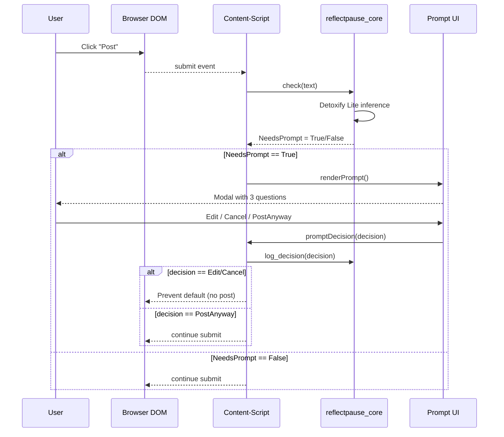
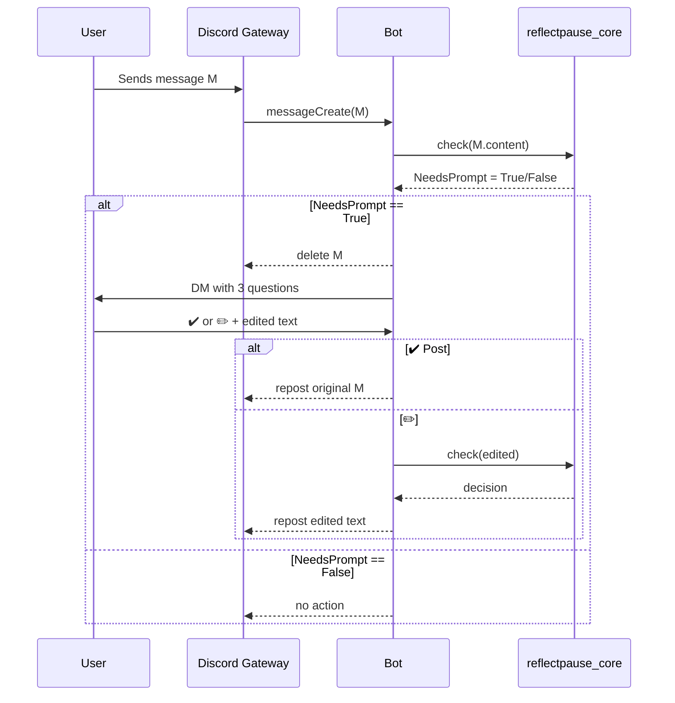

# 3. Data Flow & Sequence Diagrams

## 3.1 Extension Happy Path (Sequence)

**Latency checkpoints**

1. `submit` → `check` round‑trip ≤ 25 ms.
2. Prompt modal render ≤ 25 ms.\
   Combined ≤ 50 ms target.

## 3.2 Discord Bot Happy Path (Sequence)

**Timing checkpoints**

- Gateway to DM prompt ≤ 150 ms.
- User response handling time excluded (user dependent).
- Repost round‑trip ≤ 100 ms.

## 3.3 Error & Edge‑Case Flows

| Scenario                     | Expected Behaviour                                                        |
| ---------------------------- | ------------------------------------------------------------------------- |
| **ONNX model fails to load** | Fallback to always‑prompt mode; telemetry flags `onnx_load_error`         |
| **Perspective API 429**      | Switch to ONNX engine until hourly cooldown expires                       |
| **User has JS disabled**     | Extension detects; degrades gracefully (no prompt) and warns in console   |
| **Discord DM disabled**      | Bot mentions user in channel with polite reminder and prompts public edit |

## 3.4 Data Privacy Flow

1. **Hashing** – `sha256(user_id + timestamp)` for log keys.
2. **Opt‑in analytics** – toggle in settings; default off.
3. **Deletion request** – `/privacy delete` wipes SQLite rows and disables future logging.

---
