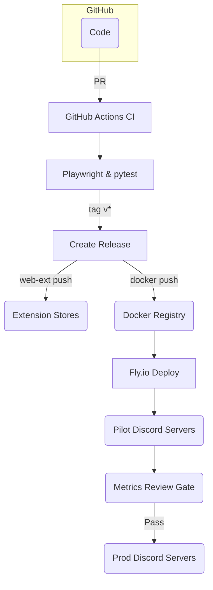

# 4. Infrastructure & Deployment

## 4.1 Hosting Topology

| Component                   | Environment        | Host / Service                              | Notes                                                             |
| --------------------------- | ------------------ | ------------------------------------------- | ----------------------------------------------------------------- |
| **Browser Extension**       | Production         | Chrome Web Store, Mozilla AMO, Edge Add‑ons | Store listings signed; auto‑publish via CI on tag `v*`            |
| **Discord Bot**             | Dev / Pilot / Prod | Fly.io free tier (Region =SIN)              | 256 MB micro‑VM, auto‑scale 0→1; < 10 USD/month if scaled         |
| **Analytics Edge Function** | Pilot / Prod       | Supabase Functions                          | Optional; only deployed if opt‑in analytics enabled               |
| **CI Pipeline**             | All                | GitHub Actions                              | Matrix: Ubuntu‑latest, Python 3.12; Chrome/Firefox headless tests |
| **Artifact Registry**       | All                | GitHub Container Registry                   | Stores Docker image `ghcr.io/reflectpause/bot`                    |

## 4.2 Environments & Promotion Flow

## 4.3 Deployment Steps (Bot)

1. CI builds multi‑stage Docker image (Python slim → Alpine) \~ 20 MB.
2. `fly deploy --image ghcr.io/reflectpause/bot:SHA` to dev app.
3. Smoke tests run via Fly checks; if ✅, promote to `pilot` app.
4. After metric gate pass (≥ 30 % incident drop), run `fly apps clone` to `prod`.
5. Scale to 1 x shared‑cpu‑1x (auto‑scale off‑hours to 0).

## 4.4 Deployment Steps (Extension)

1. CI runs `web-ext lint` + Playwright smoke tests across top 5 sites.
2. On `v*` tag, CI packages and uploads to Chrome Web Store & AMO via API tokens.
3. Manual review expected < 3 days (Chrome) / < 24 h (AMO).
4. Edge Add‑ons package generated automatically once Chrome build passes.

## 4.5 Observability & Monitoring

| Area                     | Tool                            | Thresholds / Alerts                                   |
| ------------------------ | ------------------------------- | ----------------------------------------------------- |
| **Bot uptime**           | Fly checks + Grafana Cloud Free | < 99 % weekly uptime triggers alert to Discord #ops   |
| **Extension crash rate** | Chrome Web Store dash           | > 5 % crash users triggers CI rollback tag            |
| **Latency metrics**      | Playwright test report          | Modal render > 50 ms (95th percentile) fails pipeline |
| **Security CVEs**        | Dependabot                      | High severity auto‑PR; pipeline blocked until merged  |

## 4.6 Cost Estimate (Monthly)

| Item                 | Units                 | Rate      | Cost         |
| -------------------- | --------------------- | --------- | ------------ |
| Fly.io               | 1 x app shared‑cpu‑1x | Free tier | \$0          |
| Supabase (edge + db) | 1 x project           | Free tier | \$0          |
| Perspective API      | 10 000 req/day        | Free tier | \$0          |
| Store listings       | Chrome \$5 one‑time   | amortized | \$0.42       |
| **Total**            |                       |           | **≈ \$0.42** |

## 4.7 Security & Compliance Controls

- **Secrets Management** – GitHub OIDC to Fly, avoids long‑lived API keys.
- **HTML CSP** – `script-src 'self' 'wasm-unsafe-eval';` permits Pyodide, blocks remote scripts.
- **Dependency Scanning** – Dependabot + `pip-audit`; fails build on critical CVEs.
- **Data Protection** – Only hashed IDs stored; GDPR deletion honored via `/privacy delete` and Chrome storage wipe.

---
